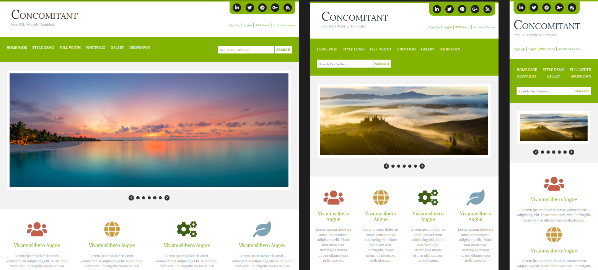

# $\color{lightblue}\text{CONCOMITANT}$

$\color{limegreen}\text{Учебная работа}$

### $\color{mediumblue}\text{Описание работы }$:

Адапривная внешняя часть шаблонной страницы сайта.

Работа на основе одного из практических заданий по курсу GeekBrains "Профессиональная вёрстка HTML/CSS".

🎯Отработать применение БЭМ в проекте.

🎯Использование подобия "flat" ( файловой структуры проекта ).

🎯Внедрение отдельных частей проекта и создание адаптивности с помощью Bootstrap.

🎯 $\color{mediumblue}\text{Основная задача}$ - применение всех изученных, на курсе, технологий и способов вёрстки.

---

Макет -> [**Figma**](https://www.figma.com/file/OsgvIlYliEA70z9bVNBFkk/concomitant?type=design&node-id=0%3A1&mode=dev&t=oTUzbguGUG7diacu-1)

Вёрстка -> [**Git pages**]()

### $\color{mediumblue}\text{Технологии, инструменты и способы вёрстки }$:

❗Figma.
❗VsCode.
❗Git.
❗Адаптивная вёрстка.
❗FlexBox.
❗БЭМ.
❗Flat.
❗Семантика.
❗Bootstrap.
